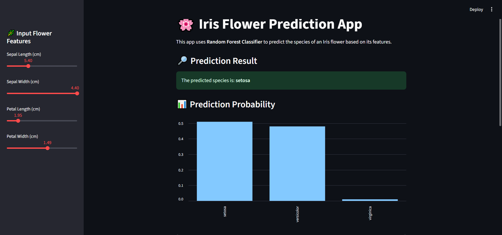
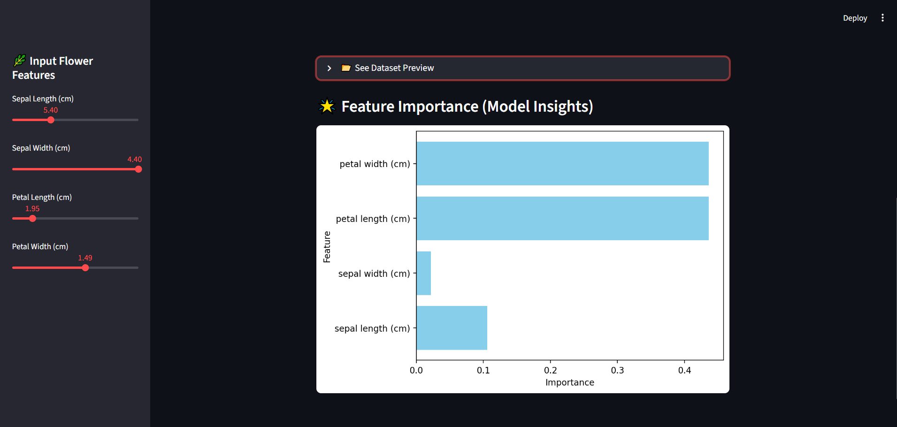
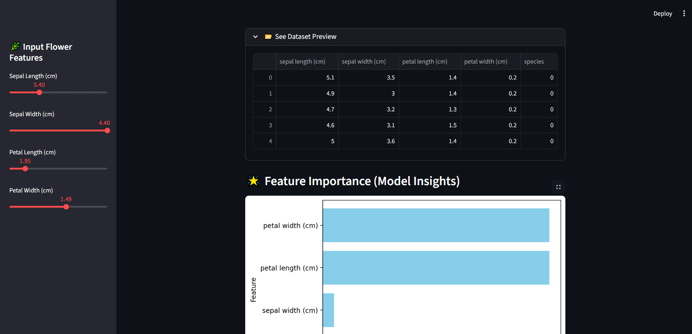

# Iris Flower Prediction App 🌸

A beginner-friendly Streamlit web application to classify Iris flower species using a Random Forest model. Built for fast, interactive predictions and educational exploration of classic machine learning concepts.

---

## 🌟 Features

- **Interactive Input:** Adjust sepal and petal measurements with sidebar sliders.
- **Live Predictions:** Instantly predict the Iris species and view probability scores.
- **Dataset Explorer:** Preview the Iris dataset and feature statistics.
- **Feature Importance:** Visualize which features matter most in classification.
- **Clean UI:** Simple, responsive dashboard for desktop and mobile.

---

## 🌐 Live Demo

Try the app instantly, no installation required:  
[https://iris-flower-classifier-app-ckb78utfqdnawpqvn2amy6.streamlit.app/](https://iris-flower-classifier-app-ckb78utfqdnawpqvn2amy6.streamlit.app/)

---

## 🖼️ Screenshots

> *Add images to the `images/` folder and update paths below.*

- **App Home:**  
  

- **Prediction Result:**  
  

- **Feature Importance Chart:**  
  

---

## 🛠️ Tech Stack

- **Python 3.7+**
- [Streamlit](https://streamlit.io/) – Interactive dashboards
- [Pandas](https://pandas.pydata.org/) – Data manipulation
- [Scikit-Learn](https://scikit-learn.org/) – Random Forest classifier
- [Matplotlib](https://matplotlib.org/) – Plotting and visualization

---

## 📦 Installation

1. **Clone the repository:**
   ```bash
   git clone https://github.com/muzammaldeveloper/iris-flower-classifier-streamlit.git
   cd iris-flower-classifier-streamlit
   ```

2. **Install dependencies:**
   ```bash
   pip install -r requirements.txt
   ```

---

## 🚀 Usage

Launch the app locally:

```bash
streamlit run app.py
```

- Use the sidebar sliders to input flower features.
- View the prediction and probabilities instantly.
- Explore dataset and feature importance charts.

---

## 📁 Project Structure

```text
iris-flower-classifier-streamlit/
├── app.py                # Main Streamlit app
├── data/
│   └── iris.csv          # Iris dataset
├── images/
│   ├── app_home.png      # Screenshot: Home
│   ├── prediction_output.png    # Screenshot: Prediction
│   └── feature_importance.png   # Screenshot: Feature importance chart
├── requirements.txt      # Python dependencies
└── README.md             # Project documentation
```

---

## 🔮 Future Improvements

- Add model comparison (SVM, KNN, etc.)
- Enable model retraining with custom data
- Deploy app on cloud platforms (Streamlit Cloud, Hugging Face Spaces)
- Add multi-language support
- Improve mobile responsiveness

---

## 🤝 Contributing

Contributions are welcome!  
If you find a bug or want to add a feature:

1. Fork this repo.
2. Create a new branch (`git checkout -b feature-name`).
3. Commit your changes with clear messages.
4. Open a pull request describing your changes.

For questions or suggestions, feel free to open an issue.

---

## 📬 Contact

- **GitHub:** [muzammaldeveloper](https://github.com/muzammaldeveloper)
- **Email:** muzammal.contect@gmail.com

---

## 👨‍💻 About the Developer

**Muzammal Hussain**  
Passionate AI developer and community builder from Pakistan. Focused on making machine learning accessible for everyone, especially learners in low-resource environments.

> *Connect, learn, and build with me!*

---

*Made with ❤️ using Python and Streamlit.*
